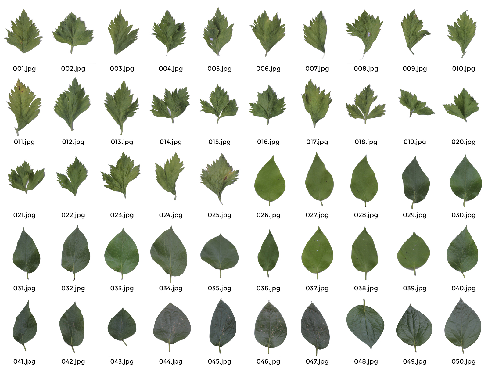

# Dataset-Daun-Sirih-dan-Seledri_295_290

<!-- TABLE OF CONTENTS -->
<details>
  <summary>Table of Contents</summary>
  <ol>
    <li><a href="#overview-dataset">Overview Dataset</a></li>
    <li>
      <a href="#description">Description</a>
      <ul>
        <li><a href="#daun-seledri">Daun Seledri</a></li>
        <li><a href="#daun-sirih">Daun Sirih</a></li>
      </ul>
    </li>
    <li>
      <a href="#ciri-ciri-umum">Ciri-ciri Umum</a></li>
    <li>
      <a href="#manfaat-dan-kandungan">Manfaat dan Kandungan</a></li>
    <li><a href="#authors">Authors</a></li>
  </ol>
</details>

## Overview Dataset
<div align="center">
  <a href="https://github.com/farlinahrul/Dataset-Daun-Sirih-dan-Seledri_295_290">
    
  </a>
</div>
<br />

## Description

### Daun Seledri
Daun Seledri merupakan salah satu daun herbal (ON PROCCESS)
### Daun Sirih
Daun Sirih juga merupakan salah satu daun herbal (ON PROCCESS)

<p align="right"><a href="#top">back to top</a></p>

## Ciri-ciri Umum
### Daun Seledri (ON PROCCESS)

* Ciri 1
* Ciri 2

### Daun Sirih (ON PROCCESS)

* Ciri 1
* Ciri 2

<p align="right"><a href="#top">back to top</a></p>

## Manfaat dan Kandungan
### Daun Seledri (ON PROCCESS)

* Manfaat 1
* Manfaat 2

### Daun Sirih (ON PROCCESS)

* Manfaat 1
* Manfaat 2
<p align="right"><a href="#top">back to top</a></p>

## Authors
Contributors names
```
1. Farli Nahrul Javier | 2019-295
2. Muhammad Iqbaludin Zaky | 2019-290
```
<p align="right"><a href="#top">back to top</a></p>
